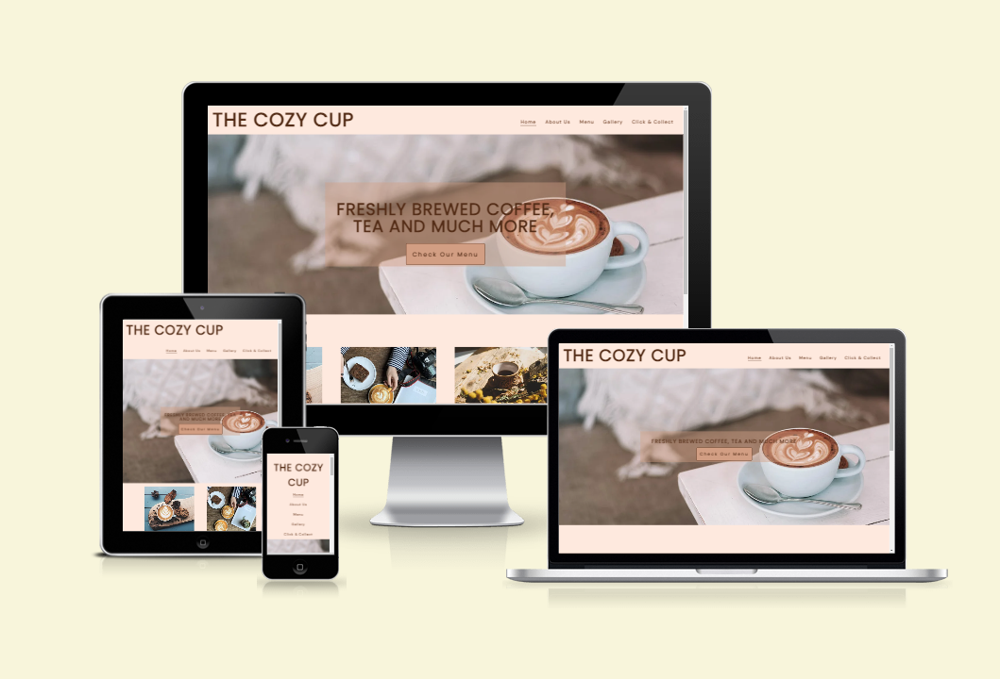
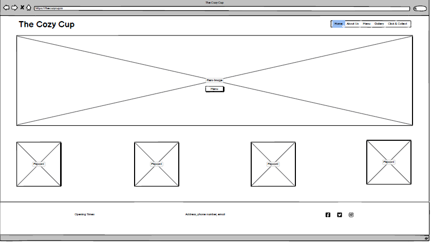
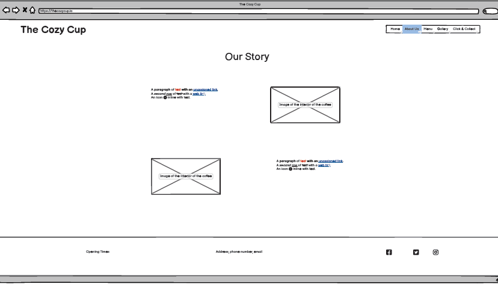
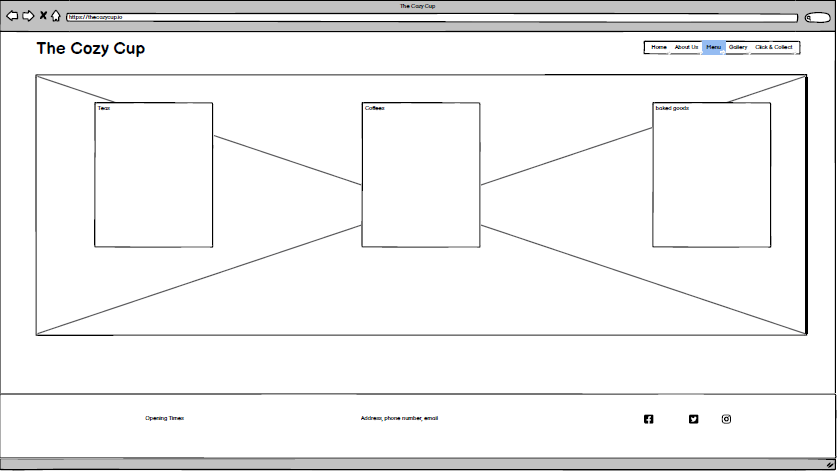
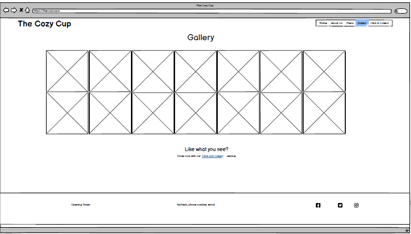
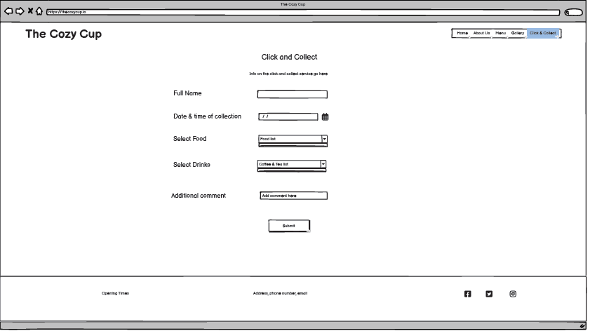
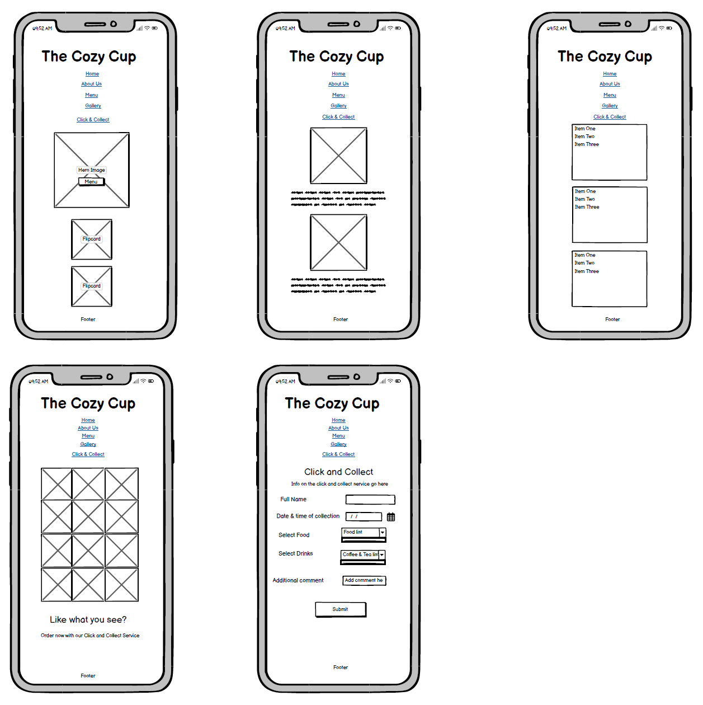
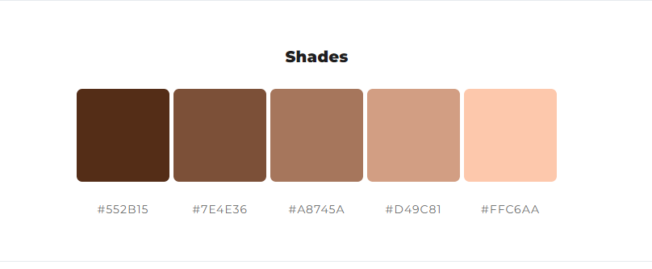

[View the live project here](https://debear92.github.io/the-cozy-cup/)

The Cozy Cup is a website for a fictional coffee shop based in Cork, Ireland. The main purpose of the website is to showcase what the Cozy Cup offer and to focus on the Click and Collect service that was recently launched. Customer can order their beverages and food and collect in as little as 15 minutes. At the moment is not possible to pay online but only when collecting. The website is targetting new and existing customer around the area of Cork to check The Cozy Cup's menu, opening hours and contact details.

# Table of Contents
- [User Experience](#user-experience)
 - [User Stories](#user-stories) 
 - [Design](#design)
- [Features](#features)
- [Technologies Used](#technologies-used)
- [Testing](#testing)
- [Bugs/Issues](#bugsissues)
- [Deployment](#deployment)
- [Credits](#credits)
- [Acknowledgements](#acknowledgements)

# User Experience

## User Stories

- As a first time visitor, I want the use to easily navigate through the site, finding out about the products and services offered at the Cozy cafe and where is based.

- As a returning visitor, I want to be able to access the menu and see if there is anything new on it. 

- As a frequent user, I want to use the site for the Click and Collect Service that I know about and I want to check for updates on the cafè opening hours.

## Design

- To guide the development of the website wireframes were designed through [Balsamiq](https://balsamiq.com/). These wireframe were only an initial guide and some features appear different in the final product. For example, I decided not to put an image as background of the menu page as I found it made the menu very difficult to read. 

- A color pallet was generated using [ColorSpace](https://mycolor.space/). I started from a brown color as it recalls the color of the coffee beans that are the main subject of "The Cozy Cup" website. 

- Two fonts were paired togheter for the website. Poppins was used in all the heading and the logo, while DM Sansa was used in the text of the page. The two fonts were chosen on [Google Fonts](https://fonts.google.com/).

- High quality images are used through the website to give returning and potential customer an idea of the products offered at The Cozy Cup.

# Features

## Navigation Bar
## Landing Page
## About Us 
## Menu
## Gallery
## Click and Collect
## Thank You Page 
## 404
## Responsivness
## Features To Implement

