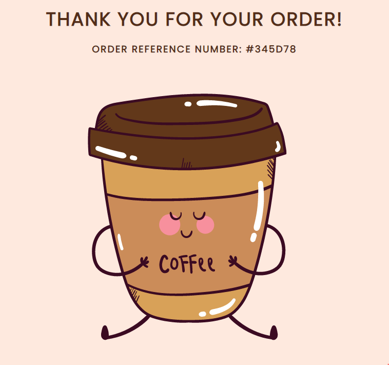
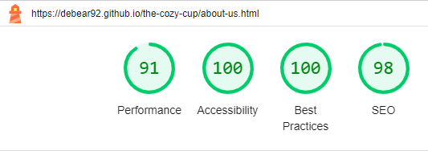

[View the live project here](https://debear92.github.io/the-cozy-cup/)

The Cozy Cup is a website for a fictional coffee shop based in Cork, Ireland. The main purpose of the website is to showcase what the Cozy Cup offer and to focus on the Click and Collect service that was recently launched. Customer can order their beverages and food and collect in as little as 15 minutes. At the moment is not possible to pay online but only when collecting. The website is targetting new and existing customer around the area of Cork to check The Cozy Cup's menu, opening hours and contact details.

# Table of Contents
- [User Experience](#user-experience)
 - [User Stories](#user-stories) 
 - [Design](#design)
- [Features](#features)
  - [Navigation Bar](#navigation-bar)
  - [Landing Page](#landing-page)
  - [Footer](#footer)
  - [About Us](#about-us)
  - [Menu](#menu)
  - [Gallery](#gallery)
  - [Click and Collect](#click-and-collect)
  - [Thank You Page](#thank-you-page)
  - [Responsivness](#responsivness)
  - [Features to implement](#features-to-implement)
- [Technologies Used](#technologies-used)
- [Testing](#testing)
- [Bugs/Issues](#bugsissues)
- [Deployment](#deployment)
- [Credits](#credits)
- [Acknowledgements](#acknowledgements)

# User Experience

## User Stories

- As a first time visitor, I want the use to easily navigate through the site, finding out about the products and services offered at the Cozy cafe and where is based.

- As a returning visitor, I want to be able to access the menu and see if there is anything new on it. 

- As a frequent user, I want to use the site for the Click and Collect Service that I know about and I want to check for updates on the cafè opening hours.

## Design

- To guide the development of the website wireframes were designed through [Balsamiq](https://balsamiq.com/). These wireframe were only an initial guide and some features appear different in the final product. For example, I decided not to put an image as background of the menu page as I found it made the menu very difficult to read. 

- A color pallet was generated using [ColorSpace](https://mycolor.space/). I started from a brown color as it recalls the color of the coffee beans that are the main subject of "The Cozy Cup" website. 

- Two fonts were paired togheter for the website. Poppins was used in all the heading and the logo, while DM Sansa was used in the text of the page. The two fonts were chosen on [Google Fonts](https://fonts.google.com/).

- High quality images are used through the website to give returning and potential customer an idea of the products offered at The Cozy Cup.

# Features

## Navigation Bar

- The site features a responsive navigation bar which includes links to Home, About Us, Menu, Gallery and Click and Collect. This allows the user to navigate easily through the website regardless of the page they are on.
- The order of the pages on the navigation bar follows the steps of the customer journey: awarness, consideration, purchase.
- To allow the user to easily orientate in the website and immediately understand which page they are on, the active page is visually highlighted.

## Landing Page

- The landing page immediately communicates to new and recurring users what the website is about and what the Cozy Cup offers.
- The hero section contains a call to action to visit the menu page.
- The flip-cards communicate the business core values in a short sentence.

## Footer

- In this section of the page users can easily find opening hours of the business, the address, the contact information and the social media links. All the links will open to a new tab to allow easy navigation for the user.
- The information are present in every page of the website  to allow the user to easily locate them without having to look for them.

## About Us 

- The site has an About Us page that contains the story of the Cozy Cup, how it was born and how it grew through the years.
- The second part of the About Us page contains the business promise to its customers.

## Menu

- The Menu page is divided in two sections: Drinks and Food
- There is a call to action "Order now" at the end of the page to redirect the user to the last phase of they customer journey: purchase.

## Gallery

- The Gallery is like a visual menu where potential customers can view what some of the items on the menu looks like.

## Click and Collect

- The Click and Collect page brings users to the end of their customer journey: the purchase.
- The form grabs just the necessary informations needed from the user to place the order.
- There is a map beside the form to show the customer exactly where to collect the order.
- Terms and condition for the service are clearly reported at the end of the page.

## Thank You Page 

- After submitting the form the user is presented with a Thank You page providing the order number that they can use for collection. 

## Responsivness

- The website was built to be fully responsive on screens from 300px wide and above.
- The responsivness has been reached with the use of different methods, mainly media queries and the use of flexbox.

## Features To Implement

- Stripe Payment on the website so that users only need to collect the order when they get to the cafè. At the moment, they can only place the order online but have to pay for it in store.
- Convert the images in the Gallery page to Modal Images with the use of Javascript.
- Implement cache policy to speed up repeat visits as suggested in Lighthouse report.

# Technologies Used 

- Wireframes were designed in [Balsamiq](https://balsamiq.com/).
- The website is built only using HTML and CSS.
- A Javascript script is being used for the [Font Awesome](https://fontawesome.com/) icons used in the footer.
- [Gitpod](https://gitpod.io/) - to write the code.
- [Github](https://github.com/) - to store the repository of the website.
- [Github Pages](https://pages.github.com/) - to deploy and host the website.
- [Google Dev Tools](https://developer.chrome.com/docs/devtools/) - to troubleshoot issues and test responsivness through various screen sizes.
- [Convertio](https://convertio.co/webp-jpg/) - to convert all images to webp.
- [Tiny PNG](https://tinypng.com/) - to compress images.
- [Favicon](https://favicon.io/) - to create favicon of the website.
- [Google Fonts](https://fonts.google.com/) - to import the fonts used in the website.
- [Am I Responsive?](https://ui.dev/amiresponsive) - to show responsivness of the website across multiple devices.

# Testing

To test my website I have opened it on different devices, to see if it was working as expected.

- Browser tested:
  - Chrome
  - Firefox
  - Edge
  - Safari

- Operating systems:
  - Windows
  - Android
  - iOS

  |Action | Expected behavious | Result|
  |-------|--------------------|-------|
  |Copy url of the browser and paste it in browser. Press enter | Browser should load index.html | Pass |
  |Scale up the window | The contentent should not stretch over a certain size | Pass |
  |Scale down the window | The contentent should be visible without having to scroll horizontally | Pass |
  |Click on each page on the navbar. | Ensure the correct page opens. | Pass |
  |Click on each link. | The page should open in a new tab. | Pass |
  |Click on the email and phone number on the footer. | Email or phone app opens. | Pass |
  |Fill the click and collect form. | Form should not be submitted without name and phone number. | Pass |
  -------

## Validator

- HTML
  - No errors were returned when passing the final version through the official [W3 Validator](https://validator.w3.org/)

  

- CSS
  - No errors were found when passing the final version through the official [Jigsaw validator](https://jigsaw.w3.org/css-validator/)

   

    
   

## Lighthouse

Every page was tested through Lighthouse for both desktop and mobile.

  
Desktop

  
  
  
  
  
  

  
Mobile

  
  
  
  
  
  

  

## Accessibility

All pages were test through Wave for accessibility

# Bugs/Issues

# Deployment

# Credits

# Aknowledgments

